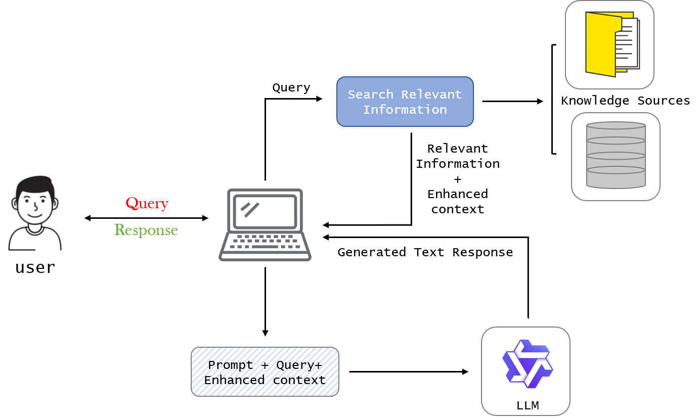
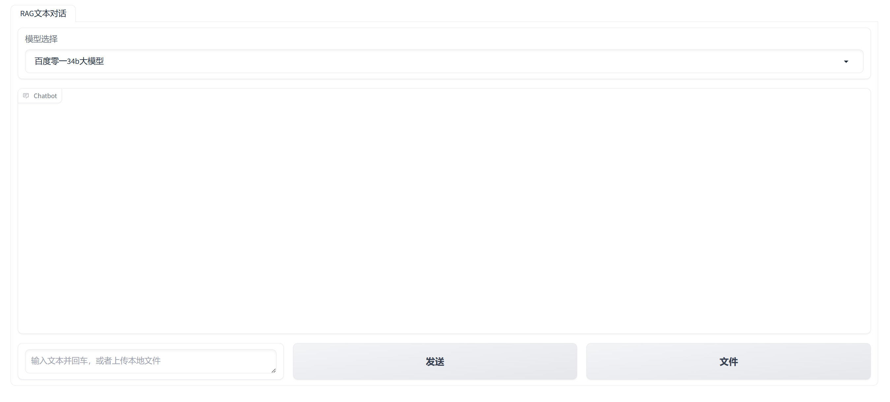

# Retrieval-Augmented Generation(RAG)

## 1.RAG原理图



## 2.RAG实现

`Embedding Model:shibing624/text2vec-base-chinese`

`LLM:baidu-yi_34b_chat`

`prompt template:`

```
qa_prompt = PromptTemplate.from_template("""
仅根据给出的上下文信息回答问题，如果从上下文信息找不到答案就说不知道。

上下文信息:
{context}

问题：{question}
""")
```

## 3.使用RAG

在`.env`文件中添加你的百度API-KEY和SECRET_KEY，具体的申领方式见网上博客。

```
BAIDU_API_KEY = your api key
BAIDU_SECRET_KEY = your secret key
FILE_NAME = 
TEXT_SPLIT_METHOD = char
CHUNK_SIZE = 1024
CHUNK_OVERLAP = 128
PERSIST_DIRECTOR = ./DataBase/
VECTOR_DB_NAME = chroma
MODEL_NAME = baidu-yi_34b_chat
FILE_PATH = 
EMBEDDING_MODEL_NAME = text2vec-base-chinese
```

运行RAG:

```
python web_main.py
```

得到如下界面：



首先在`模型选择`中选择`百度零一34b大模型`，然后点击`文件`按钮上传文件，之后进行提问即可。